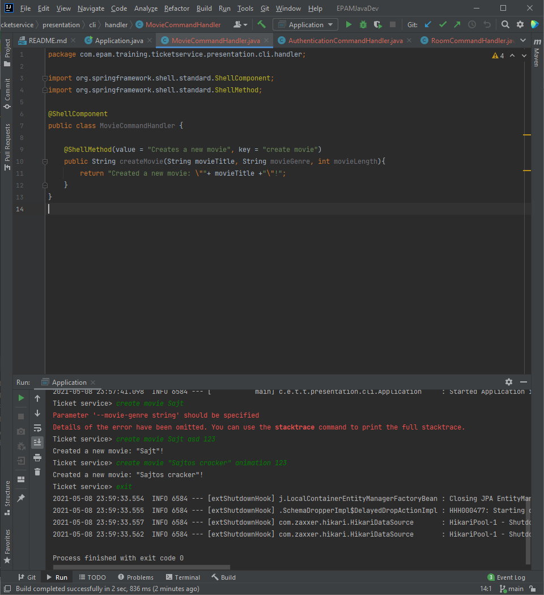

# EPAMJavaDev
Project for EPAM Java Development course.

## DevLog:

---
### Work Table

| Finish date | Job | Description | Time taken |
| -- | -- | -- | -- |
| 2021.05.08. | Initialization | Creating Git repository with necessary files like .gitignore, README.md, etc... |
| 2021.05.08. | Project setup | Forked the project frame from epam-deik-cooperation/epam-deik-java-dev, and made some changes in configuration files. |
| 2021.05.09. 01:00 | CLI | Finished the frame of the CLI. | 1h |
---

### Interesting

First command implemented at 05.09. 00:00.

---
